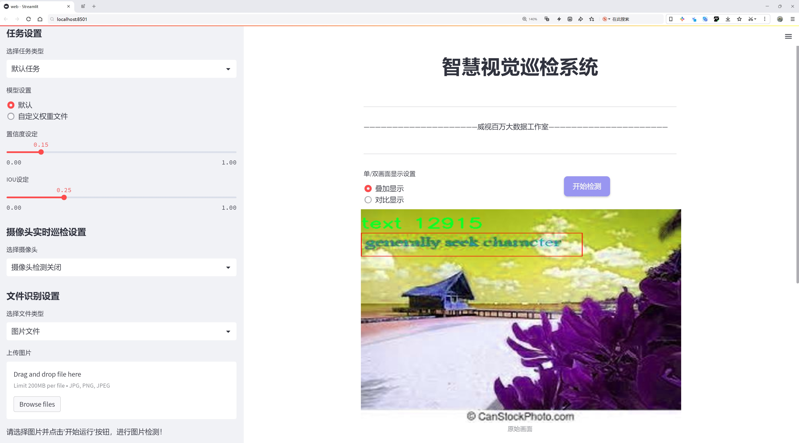
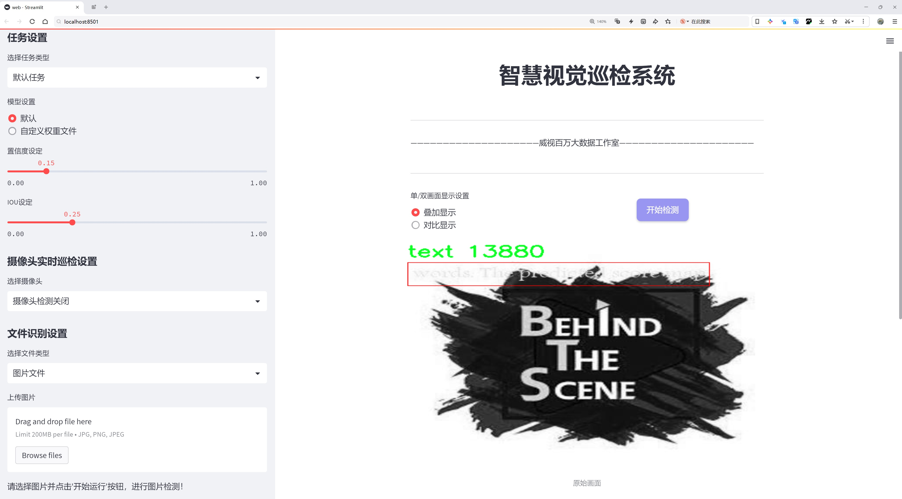
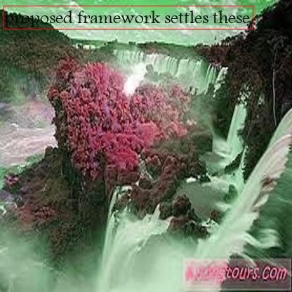
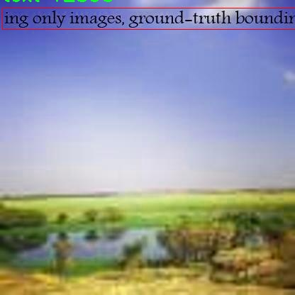
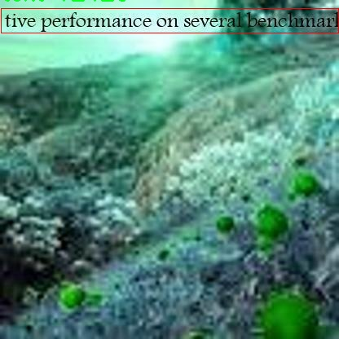
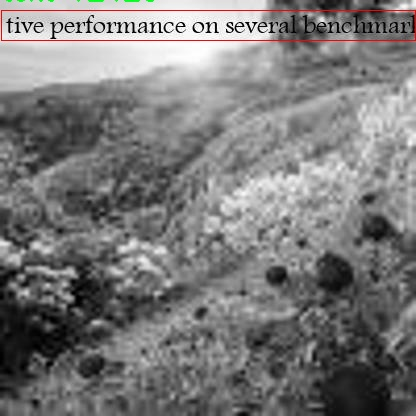

# 文本检测检测系统源码分享
 # [一条龙教学YOLOV8标注好的数据集一键训练_70+全套改进创新点发刊_Web前端展示]

### 1.研究背景与意义

项目参考[AAAI Association for the Advancement of Artificial Intelligence](https://gitee.com/qunshansj/projects)

项目来源[AACV Association for the Advancement of Computer Vision](https://gitee.com/qunmasj/projects)

研究背景与意义

随着信息技术的迅猛发展，文本信息的获取与处理在各个领域中变得愈发重要。尤其是在图像处理和计算机视觉领域，文本检测技术的应用范围广泛，包括但不限于自动驾驶、智能监控、文档数字化和增强现实等场景。近年来，深度学习技术的进步为文本检测提供了新的解决方案，其中YOLO（You Only Look Once）系列模型因其高效性和实时性受到广泛关注。YOLOv8作为该系列的最新版本，进一步提升了目标检测的精度和速度，但在复杂场景下的文本检测仍面临诸多挑战。因此，基于改进YOLOv8的文本检测系统的研究具有重要的学术价值和应用前景。

ICDAR 2015文本检测数据集是一个广泛使用的基准数据集，包含2100幅图像，专注于文本的检测与识别。该数据集的独特之处在于其多样化的文本场景，包括自然场景中的文本、街道标识、广告牌等，极大地丰富了模型训练和评估的环境。通过对该数据集的深入分析与应用，研究者可以更好地理解文本在不同背景下的表现特征，从而为改进YOLOv8模型提供有力的数据支持。数据集中只有一个类别，即“文本”，这使得研究者能够专注于文本检测的精度提升，而不必分散精力于其他类别的目标检测。

在当前的研究背景下，文本检测系统的性能不仅依赖于模型的架构设计，还受到数据集质量和多样性的影响。ICDAR 2015数据集的图像数量虽然相对有限，但其标注的准确性和场景的多样性为模型的训练提供了坚实的基础。通过对YOLOv8模型的改进，研究者可以探索如何在保持实时检测速度的同时，提升文本检测的准确率。这种改进可能涉及网络结构的优化、损失函数的调整以及数据增强技术的应用等多个方面。

此外，随着社会对信息提取效率的要求不断提高，基于改进YOLOv8的文本检测系统在实际应用中的意义愈发凸显。例如，在智能交通系统中，实时识别和处理交通标识上的文本信息对于提高交通安全和管理效率至关重要。在文档数字化过程中，准确提取文本信息能够显著提升信息检索的效率和准确性。因此，研究基于改进YOLOv8的文本检测系统，不仅能够推动学术界在计算机视觉领域的进步，还能为实际应用提供强有力的技术支持。

综上所述，基于改进YOLOv8的文本检测系统的研究，不仅有助于提升文本检测的技术水平，还有助于推动相关领域的应用创新。通过充分利用ICDAR 2015数据集的优势，研究者可以在文本检测的精度和效率上取得新的突破，为未来的研究和应用奠定坚实的基础。

### 2.图片演示






##### 注意：由于此博客编辑较早，上面“2.图片演示”和“3.视频演示”展示的系统图片或者视频可能为老版本，新版本在老版本的基础上升级如下：（实际效果以升级的新版本为准）

  （1）适配了YOLOV8的“目标检测”模型和“实例分割”模型，通过加载相应的权重（.pt）文件即可自适应加载模型。

  （2）支持“图片识别”、“视频识别”、“摄像头实时识别”三种识别模式。

  （3）支持“图片识别”、“视频识别”、“摄像头实时识别”三种识别结果保存导出，解决手动导出（容易卡顿出现爆内存）存在的问题，识别完自动保存结果并导出到tempDir中。

  （4）支持Web前端系统中的标题、背景图等自定义修改，后面提供修改教程。

  另外本项目提供训练的数据集和训练教程,暂不提供权重文件（best.pt）,需要您按照教程进行训练后实现图片演示和Web前端界面演示的效果。

### 3.视频演示

[3.1 视频演示](https://www.bilibili.com/video/BV1TWtLeDEqx/)

### 4.数据集信息展示

##### 4.1 本项目数据集详细数据（类别数＆类别名）

nc: 1
names: ['text']


##### 4.2 本项目数据集信息介绍

数据集信息展示

在现代计算机视觉领域，文本检测技术的进步对于各种应用场景至关重要，尤其是在文档分析、自动驾驶、智能监控等领域。为了推动这一技术的发展，本研究选用了“icdar2015 text”数据集作为训练改进YOLOv8文本检测系统的基础。该数据集是由国际文档分析与识别会议（ICDAR）组织的，旨在为文本检测算法提供标准化的评估基准。其独特之处在于，数据集专注于文本的检测与识别，涵盖了多种复杂的场景和文本布局，极大地丰富了算法的训练和测试环境。

“icdar2015 text”数据集的设计考虑到了文本在不同背景下的多样性和复杂性，包含了来自自然场景的图像，涉及街道标识、广告牌、商店招牌等多种实际应用场景。这些图像不仅包含了各种字体、颜色和大小的文本，还涵盖了不同的光照条件和视角变化，使得数据集在训练过程中能够有效提高模型的鲁棒性和适应性。通过对这些多样化场景的学习，YOLOv8模型能够更好地理解和识别各种文本特征，从而提升其在实际应用中的表现。

在类别方面，“icdar2015 text”数据集的设置相对简洁，只有一个类别，即“text”。这一类别的设计旨在专注于文本的检测任务，避免了多类别间的干扰，使得模型能够专注于文本区域的精确定位和识别。尽管类别数量有限，但数据集中的样本数量和多样性弥补了这一不足，确保了模型在处理文本时的高效性和准确性。

数据集的标注采用了精确的边界框（bounding box）标注方式，为每个文本区域提供了准确的位置信息。这种标注方式不仅便于模型进行训练，也为后续的评估提供了清晰的标准。通过对这些标注数据的学习，YOLOv8能够在图像中快速而准确地定位文本区域，进而实现高效的文本检测。

在数据集的使用过程中，研究者们可以通过数据增强技术进一步丰富训练样本，提升模型的泛化能力。常见的数据增强方法包括随机裁剪、旋转、颜色变换等，这些方法能够有效增加模型对不同场景和条件的适应性。此外，结合迁移学习等先进技术，研究者可以在已有的YOLOv8模型基础上进行微调，从而实现更优的文本检测效果。

总之，“icdar2015 text”数据集为改进YOLOv8文本检测系统提供了一个高质量的训练基础。通过充分利用该数据集的多样性和丰富性，研究者能够有效提升模型在实际应用中的表现，推动文本检测技术的进一步发展。这一数据集不仅是文本检测领域的重要资源，也为后续的研究和应用提供了坚实的基础。










### 5.全套项目环境部署视频教程（零基础手把手教学）

[5.1 环境部署教程链接（零基础手把手教学）](https://www.ixigua.com/7404473917358506534?logTag=c807d0cbc21c0ef59de5)


[5.2 安装Python虚拟环境创建和依赖库安装视频教程链接（零基础手把手教学）](https://www.ixigua.com/7404474678003106304?logTag=1f1041108cd1f708b01a)

### 6.手把手YOLOV8训练视频教程（零基础小白有手就能学会）

[6.1 手把手YOLOV8训练视频教程（零基础小白有手就能学会）](https://www.ixigua.com/7404477157818401292?logTag=d31a2dfd1983c9668658)

### 7.70+种全套YOLOV8创新点代码加载调参视频教程（一键加载写好的改进模型的配置文件）

[7.1 70+种全套YOLOV8创新点代码加载调参视频教程（一键加载写好的改进模型的配置文件）](https://www.ixigua.com/7404478314661806627?logTag=29066f8288e3f4eea3a4)

### 8.70+种全套YOLOV8创新点原理讲解（非科班也可以轻松写刊发刊，V10版本正在科研待更新）

由于篇幅限制，每个创新点的具体原理讲解就不一一展开，具体见下列网址中的创新点对应子项目的技术原理博客网址【Blog】：


[8.1 70+种全套YOLOV8创新点原理讲解链接](https://gitee.com/qunmasj/good)

### 9.系统功能展示（检测对象为举例，实际内容以本项目数据集为准）

图9.1.系统支持检测结果表格显示

  图9.2.系统支持置信度和IOU阈值手动调节

  图9.3.系统支持自定义加载权重文件best.pt(需要你通过步骤5中训练获得)

  图9.4.系统支持摄像头实时识别

  图9.5.系统支持图片识别

  图9.6.系统支持视频识别

  图9.7.系统支持识别结果文件自动保存

  图9.8.系统支持Excel导出检测结果数据


### 10.原始YOLOV8算法原理

原始YOLOv8算法原理

YOLO（You Only Look Once）系列算法自其首次提出以来，便以其高效的目标检测能力而受到广泛关注。YOLOv8作为该系列的最新版本，承载了前几代算法的优点，并在此基础上进行了多项创新和改进，旨在提升目标检测的精度和速度。YOLOv8的核心思想是将目标检测任务转化为一个回归问题，通过一个单一的神经网络模型，实时预测目标的位置和类别，从而实现高效的目标检测。

YOLOv8的网络结构由三个主要部分组成：主干网络（backbone）、特征增强网络（neck）和检测头（head）。在主干网络部分，YOLOv8继续采用CSP（Cross Stage Partial）结构，这种设计理念使得网络能够有效地提取特征，同时减少计算量。与之前的YOLO版本相比，YOLOv8在主干网络中引入了C2F模块，这一模块通过并行多个梯度流分支，增强了特征提取的能力，从而提高了模型的整体性能。C2F模块的设计不仅保证了网络的轻量化，还有效提升了精度和延迟表现，使得YOLOv8在处理复杂场景时能够更为游刃有余。

在特征增强网络部分，YOLOv8采用了PAN-FPN（Path Aggregation Network - Feature Pyramid Network）的思想。这一结构通过不同层次特征的融合，进一步增强了模型对多尺度目标的检测能力。PAN-FPN的设计使得特征信息能够在不同层次之间有效传递，从而提升了对小目标和大目标的检测精度。此外，YOLOv8在Neck部分的改进还体现在去除了多余的卷积连接层，直接对不同阶段输出的特征进行上采样操作，这一简化设计有效减少了计算复杂度。

YOLOv8的检测头部分是其创新的关键所在。与以往的耦合头（Coupled-Head）不同，YOLOv8采用了解耦头（Decoupled-Head）结构，将目标的分类和回归任务分为两个独立的分支。这一设计使得每个任务能够更加专注于自身的目标，从而有效减少了在复杂场景下可能出现的定位不准和分类错误的问题。解耦头的引入不仅提升了模型的可解释性，也为后续的优化提供了更大的灵活性。

在损失函数的设计上，YOLOv8同样进行了重要的改进。为了提高模型在训练和推理过程中的一致性，YOLOv8取消了Obj分支，分类分支依然采用二值交叉熵损失（BCELoss），而边界框回归分支则使用了分布焦点损失（DFL）和完美交并比损失（CIoULoss）。这种新的损失策略使得网络能够更快地聚焦于标签附近的数值，从而提升了检测精度。

YOLOv8还引入了Anchor-free目标检测方法，这一方法与传统的Anchor-based方法截然不同。传统方法依赖于预先定义的锚框来预测目标位置，这种方式在处理不同尺度和形状的目标时往往显得不够灵活。而YOLOv8通过将目标检测转化为关键点检测，直接预测目标的位置和大小，避免了锚框选择和调整的繁琐过程。这一创新不仅提升了模型的泛化能力，也使得网络框架更加简洁，计算效率显著提高。

在输入处理方面，YOLOv8同样展现了其灵活性。默认输入图像尺寸为640x640，但在实际应用中，YOLOv8采用自适应图片缩放技术，以提高目标检测和推理的速度。这一方法通过将长边按比例缩小至指定尺寸，并对短边进行填充，尽量减少信息冗余，确保了目标检测的高效性。此外，YOLOv8在训练过程中引入了Mosaic图像增强操作，通过随机拼接多张图像，迫使模型学习不同位置和周围像素的特征，从而进一步提升了模型的鲁棒性和准确性。

综上所述，YOLOv8在多个方面进行了创新和优化，使其在目标检测领域中展现出更强的性能和灵活性。通过引入解耦头、Anchor-free方法以及改进的损失函数，YOLOv8不仅提升了检测精度，也降低了计算复杂度，使其能够在实时检测任务中表现出色。这些改进使得YOLOv8成为了当前最先进的目标检测算法之一，适用于各种应用场景，包括图像分割和图像分类等任务。随着YOLOv8的不断发展和完善，其在实际应用中的潜力将会进一步得到挖掘，为目标检测技术的进步做出更大的贡献。


### 11.项目核心源码讲解（再也不用担心看不懂代码逻辑）

#### 11.1 code\ultralytics\utils\callbacks\hub.py

以下是对代码的核心部分进行的提炼和详细注释：

```python
# Ultralytics YOLO 🚀, AGPL-3.0 license

import json
from time import time
from ultralytics.hub.utils import HUB_WEB_ROOT, PREFIX, events
from ultralytics.utils import LOGGER, SETTINGS

def on_fit_epoch_end(trainer):
    """在每个训练周期结束时上传训练进度指标。"""
    session = getattr(trainer, "hub_session", None)  # 获取训练器的会话对象
    if session:
        # 收集训练损失和指标
        all_plots = {
            **trainer.label_loss_items(trainer.tloss, prefix="train"),  # 获取训练损失
            **trainer.metrics,  # 获取训练指标
        }
        if trainer.epoch == 0:
            from ultralytics.utils.torch_utils import model_info_for_loggers
            # 在第一个周期时，添加模型信息
            all_plots = {**all_plots, **model_info_for_loggers(trainer)}

        # 将当前周期的指标序列化为JSON格式并存入队列
        session.metrics_queue[trainer.epoch] = json.dumps(all_plots)
        
        # 检查是否超过上传速率限制
        if time() - session.timers["metrics"] > session.rate_limits["metrics"]:
            session.upload_metrics()  # 上传指标
            session.timers["metrics"] = time()  # 重置计时器
            session.metrics_queue = {}  # 重置队列

def on_model_save(trainer):
    """保存检查点到Ultralytics HUB，并进行速率限制。"""
    session = getattr(trainer, "hub_session", None)  # 获取训练器的会话对象
    if session:
        is_best = trainer.best_fitness == trainer.fitness  # 判断当前模型是否是最佳模型
        # 检查是否超过上传速率限制
        if time() - session.timers["ckpt"] > session.rate_limits["ckpt"]:
            LOGGER.info(f"{PREFIX}Uploading checkpoint {HUB_WEB_ROOT}/models/{session.model_file}")
            session.upload_model(trainer.epoch, trainer.last, is_best)  # 上传模型
            session.timers["ckpt"] = time()  # 重置计时器

def on_train_end(trainer):
    """在训练结束时上传最终模型和指标到Ultralytics HUB。"""
    session = getattr(trainer, "hub_session", None)  # 获取训练器的会话对象
    if session:
        LOGGER.info(f"{PREFIX}Syncing final model...")
        # 上传最终模型和指标
        session.upload_model(
            trainer.epoch,
            trainer.best,
            map=trainer.metrics.get("metrics/mAP50-95(B)", 0),
            final=True,
        )
        session.alive = False  # 停止心跳
        LOGGER.info(f"{PREFIX}Done ✅\n" f"{PREFIX}View model at {session.model_url} 🚀")

# 回调函数集合，根据设置决定是否启用
callbacks = (
    {
        "on_fit_epoch_end": on_fit_epoch_end,  # 训练周期结束时的回调
        "on_model_save": on_model_save,  # 模型保存时的回调
        "on_train_end": on_train_end,  # 训练结束时的回调
    }
    if SETTINGS["hub"] is True
    else {}
)  # 验证是否启用
```

### 代码核心部分分析：
1. **`on_fit_epoch_end`**: 该函数在每个训练周期结束时被调用，负责收集训练损失和指标，并将其上传到Ultralytics HUB。它还处理了上传速率限制，以避免过于频繁的上传。

2. **`on_model_save`**: 该函数负责在训练过程中保存模型检查点，并确保上传不超过速率限制。它会判断当前模型是否是最佳模型，并在合适的时机上传。

3. **`on_train_end`**: 该函数在训练结束时被调用，负责上传最终的模型和训练指标。它会记录训练完成的信息，并停止与Ultralytics HUB的心跳。

4. **`callbacks`**: 这是一个回调函数的集合，决定了在不同训练阶段需要执行的操作。根据设置决定是否启用这些回调。

以上代码的核心功能是确保训练过程中的数据能够有效地上传到Ultralytics HUB，同时管理上传的频率和模型的保存。

这个文件是Ultralytics YOLO项目中的一个回调函数模块，主要用于在训练、验证和导出模型的不同阶段与Ultralytics HUB进行交互。代码中定义了一系列的回调函数，这些函数在特定事件发生时被调用，以便记录训练进度、上传模型和指标等。

首先，文件导入了一些必要的库，包括`json`和`time`，以及Ultralytics项目中的一些工具和设置。接下来，定义了一些回调函数：

- `on_pretrain_routine_end(trainer)`：这个函数在预训练例程结束时被调用，主要用于初始化上传速率限制的计时器。它检查训练器是否有与HUB的会话，如果有，则开始记录时间。

- `on_fit_epoch_end(trainer)`：在每个训练周期结束时调用，负责上传训练进度的指标。它会将当前的损失和其他指标打包成一个字典，并在适当的时间间隔内上传这些指标到HUB。

- `on_model_save(trainer)`：这个函数在模型保存时被调用，负责将模型检查点上传到HUB。它会检查当前的训练效果是否是最佳的，并在满足速率限制的情况下进行上传。

- `on_train_end(trainer)`：训练结束时调用，负责上传最终的模型和指标到HUB。它会记录训练的最佳结果，并在上传后停止心跳信号。

- `on_train_start(trainer)`、`on_val_start(validator)`、`on_predict_start(predictor)`和`on_export_start(exporter)`：这些函数在训练、验证、预测和导出开始时被调用，主要用于执行与这些事件相关的操作。

最后，代码中定义了一个`callbacks`字典，包含了上述所有回调函数。如果设置中启用了HUB功能，则这些回调函数会被注册，以便在相应的事件发生时调用。

总体而言，这个文件的主要功能是实现与Ultralytics HUB的交互，确保在训练和模型管理过程中能够有效地上传和记录重要的训练信息和模型状态。

#### 11.2 ui.py

```python
import sys
import subprocess

def run_script(script_path):
    """
    使用当前 Python 环境运行指定的脚本。

    Args:
        script_path (str): 要运行的脚本路径

    Returns:
        None
    """
    # 获取当前 Python 解释器的路径
    python_path = sys.executable

    # 构建运行命令，使用 streamlit 运行指定的脚本
    command = f'"{python_path}" -m streamlit run "{script_path}"'

    # 执行命令
    result = subprocess.run(command, shell=True)
    # 检查命令执行的返回码，若不为0则表示出错
    if result.returncode != 0:
        print("脚本运行出错。")

# 主程序入口
if __name__ == "__main__":
    # 指定要运行的脚本路径
    script_path = "web.py"  # 这里可以直接指定脚本路径

    # 调用函数运行脚本
    run_script(script_path)
```

### 代码注释说明：
1. **导入模块**：
   - `sys`：用于获取当前 Python 解释器的路径。
   - `subprocess`：用于执行外部命令。

2. **`run_script` 函数**：
   - 该函数接受一个参数 `script_path`，表示要运行的 Python 脚本的路径。
   - 使用 `sys.executable` 获取当前 Python 解释器的路径。
   - 构建一个命令字符串，用于通过 `streamlit` 运行指定的脚本。
   - 使用 `subprocess.run` 执行构建的命令，并检查返回码以判断脚本是否成功运行。

3. **主程序入口**：
   - 在 `if __name__ == "__main__":` 语句中，指定要运行的脚本路径（此处为 `web.py`）。
   - 调用 `run_script` 函数来执行指定的脚本。

这个程序文件的主要功能是通过当前的 Python 环境来运行一个指定的脚本，具体来说是一个名为 `web.py` 的脚本。首先，程序导入了必要的模块，包括 `sys`、`os` 和 `subprocess`，这些模块分别用于系统相关的操作、文件路径处理和执行外部命令。

在程序中定义了一个名为 `run_script` 的函数，该函数接受一个参数 `script_path`，表示要运行的脚本的路径。函数内部首先获取当前 Python 解释器的路径，使用 `sys.executable` 来实现。接着，构建一个命令字符串，这个命令将使用 `streamlit` 来运行指定的脚本。具体的命令格式是将 Python 解释器的路径和要运行的脚本路径结合在一起，形成一个完整的命令。

然后，使用 `subprocess.run` 方法来执行这个命令，`shell=True` 参数允许在 shell 中执行命令。执行后，程序会检查命令的返回码，如果返回码不为零，表示脚本运行过程中出现了错误，此时会打印出一条错误信息。

在文件的最后部分，使用 `if __name__ == "__main__":` 语句来确保只有在直接运行该文件时才会执行后面的代码。在这里，指定了要运行的脚本路径为 `web.py`，并调用 `run_script` 函数来执行这个脚本。

总的来说，这个程序文件的功能是通过当前的 Python 环境运行一个 Streamlit 应用脚本，并在运行过程中处理可能出现的错误。

#### 11.3 70+种YOLOv8算法改进源码大全和调试加载训练教程（非必要）\ultralytics\trackers\byte_tracker.py

以下是经过简化和注释的核心代码部分，主要保留了 `STrack` 和 `BYTETracker` 类的核心功能。

```python
import numpy as np
from .basetrack import BaseTrack, TrackState
from .utils import matching
from .utils.kalman_filter import KalmanFilterXYAH

class STrack(BaseTrack):
    """
    单目标跟踪表示，使用卡尔曼滤波进行状态估计。
    该类负责存储单个轨迹的信息，并根据卡尔曼滤波进行状态更新和预测。
    """

    shared_kalman = KalmanFilterXYAH()  # 共享的卡尔曼滤波器实例

    def __init__(self, tlwh, score, cls):
        """初始化新的STrack实例。"""
        # 将边界框的tlwh格式转换为内部存储格式
        self._tlwh = np.asarray(self.tlbr_to_tlwh(tlwh[:-1]), dtype=np.float32)
        self.kalman_filter = None  # 特定对象的卡尔曼滤波器
        self.mean, self.covariance = None, None  # 状态均值和协方差
        self.is_activated = False  # 跟踪是否被激活的标志

        self.score = score  # 置信度分数
        self.tracklet_len = 0  # 轨迹长度
        self.cls = cls  # 目标类别
        self.idx = tlwh[-1]  # 目标索引

    def predict(self):
        """使用卡尔曼滤波器预测对象的下一个状态。"""
        mean_state = self.mean.copy()  # 复制当前均值状态
        if self.state != TrackState.Tracked:
            mean_state[7] = 0  # 如果状态不是跟踪状态，设置速度为0
        self.mean, self.covariance = self.kalman_filter.predict(mean_state, self.covariance)

    def activate(self, kalman_filter, frame_id):
        """激活新的轨迹。"""
        self.kalman_filter = kalman_filter  # 设置卡尔曼滤波器
        self.track_id = self.next_id()  # 获取新的轨迹ID
        self.mean, self.covariance = self.kalman_filter.initiate(self.convert_coords(self._tlwh))  # 初始化状态

        self.tracklet_len = 0  # 重置轨迹长度
        self.state = TrackState.Tracked  # 设置状态为跟踪
        if frame_id == 1:
            self.is_activated = True  # 如果是第一帧，激活轨迹
        self.frame_id = frame_id  # 当前帧ID
        self.start_frame = frame_id  # 轨迹开始帧

    def update(self, new_track, frame_id):
        """更新匹配轨迹的状态。"""
        self.frame_id = frame_id  # 更新当前帧ID
        self.tracklet_len += 1  # 增加轨迹长度

        new_tlwh = new_track.tlwh  # 获取新的边界框
        self.mean, self.covariance = self.kalman_filter.update(self.mean, self.covariance,
                                                               self.convert_coords(new_tlwh))  # 更新状态
        self.state = TrackState.Tracked  # 设置状态为跟踪
        self.is_activated = True  # 激活轨迹

        self.score = new_track.score  # 更新置信度分数
        self.cls = new_track.cls  # 更新目标类别
        self.idx = new_track.idx  # 更新目标索引

class BYTETracker:
    """
    BYTETracker: 基于YOLOv8的目标检测和跟踪算法。
    该类负责初始化、更新和管理视频序列中检测到的对象的轨迹。
    """

    def __init__(self, args, frame_rate=30):
        """初始化YOLOv8对象以跟踪目标。"""
        self.tracked_stracks = []  # 成功激活的轨迹列表
        self.lost_stracks = []  # 丢失的轨迹列表
        self.removed_stracks = []  # 移除的轨迹列表

        self.frame_id = 0  # 当前帧ID
        self.args = args  # 命令行参数
        self.max_time_lost = int(frame_rate / 30.0 * args.track_buffer)  # 最大丢失时间
        self.kalman_filter = self.get_kalmanfilter()  # 获取卡尔曼滤波器
        self.reset_id()  # 重置ID

    def update(self, results, img=None):
        """使用新检测更新对象跟踪器。"""
        self.frame_id += 1  # 增加帧ID
        activated_stracks = []  # 激活的轨迹
        refind_stracks = []  # 重新找到的轨迹
        lost_stracks = []  # 丢失的轨迹
        removed_stracks = []  # 移除的轨迹

        scores = results.conf  # 获取置信度分数
        bboxes = results.xyxy  # 获取边界框
        bboxes = np.concatenate([bboxes, np.arange(len(bboxes)).reshape(-1, 1)], axis=-1)  # 添加索引
        cls = results.cls  # 获取类别

        # 根据置信度阈值筛选检测
        remain_inds = scores > self.args.track_high_thresh
        dets = bboxes[remain_inds]  # 高置信度检测
        scores_keep = scores[remain_inds]  # 保留的分数
        cls_keep = cls[remain_inds]  # 保留的类别

        # 初始化新的轨迹
        detections = self.init_track(dets, scores_keep, cls_keep, img)
        # 处理已跟踪的轨迹
        unconfirmed = [track for track in self.tracked_stracks if not track.is_activated]
        tracked_stracks = [track for track in self.tracked_stracks if track.is_activated]

        # 进行卡尔曼滤波预测
        strack_pool = self.joint_stracks(tracked_stracks, self.lost_stracks)
        self.multi_predict(strack_pool)

        # 计算距离并进行匹配
        dists = self.get_dists(strack_pool, detections)
        matches, u_track, u_detection = matching.linear_assignment(dists, thresh=self.args.match_thresh)

        # 更新匹配的轨迹
        for itracked, idet in matches:
            track = strack_pool[itracked]
            det = detections[idet]
            track.update(det, self.frame_id)  # 更新轨迹
            activated_stracks.append(track)  # 添加到激活轨迹列表

        # 处理未确认的轨迹
        for it in u_track:
            track = strack_pool[it]
            if track.state != TrackState.Lost:
                track.mark_lost()  # 标记为丢失
                lost_stracks.append(track)  # 添加到丢失轨迹列表

        # 初始化新的轨迹
        for inew in u_detection:
            track = detections[inew]
            if track.score < self.args.new_track_thresh:
                continue
            track.activate(self.kalman_filter, self.frame_id)  # 激活新轨迹
            activated_stracks.append(track)

        # 更新状态
        self.tracked_stracks = self.joint_stracks(self.tracked_stracks, activated_stracks)
        self.lost_stracks = self.sub_stracks(self.lost_stracks, self.tracked_stracks)

        return np.asarray(
            [x.tlbr.tolist() + [x.track_id, x.score, x.cls, x.idx] for x in self.tracked_stracks if x.is_activated],
            dtype=np.float32)  # 返回激活的轨迹信息
```

### 代码注释说明
1. **STrack 类**: 负责单个目标的跟踪，使用卡尔曼滤波器进行状态预测和更新。
   - `__init__`: 初始化跟踪对象，设置初始状态和属性。
   - `predict`: 预测下一个状态。
   - `activate`: 激活新的轨迹。
   - `update`: 更新轨迹状态。

2. **BYTETracker 类**: 负责整体的目标跟踪管理，处理多目标的激活、丢失和更新。
   - `__init__`: 初始化跟踪器，设置参数和状态。
   - `update`: 更新跟踪器，处理新检测的目标，进行匹配和状态更新。

通过这些核心功能，`STrack` 和 `BYTETracker` 类实现了基于卡尔曼滤波的目标跟踪算法。

这个程序文件是一个实现对象跟踪的模块，主要基于YOLOv8算法，使用了卡尔曼滤波器来进行状态估计和预测。文件中定义了两个主要的类：`STrack`和`BYTETracker`。

`STrack`类用于表示单个对象的跟踪信息。它通过卡尔曼滤波器来更新和预测对象的状态。该类包含多个属性，例如用于存储边界框的坐标和尺寸的`_tlwh`，用于状态估计的均值和协方差，跟踪的激活状态、置信度分数、跟踪长度、类别标签和索引等。`STrack`类的方法包括预测下一个状态、激活新的跟踪、更新匹配的跟踪状态等。此外，类中还提供了坐标转换的方法，将不同格式的边界框进行转换。

`BYTETracker`类则是一个更高层次的跟踪算法，负责管理和更新检测到的对象的跟踪状态。它维护了跟踪成功、丢失和移除的跟踪列表，并利用卡尔曼滤波器预测新的对象位置。该类的主要方法包括更新跟踪器以处理新的检测结果、初始化跟踪、计算跟踪与检测之间的距离、以及处理跟踪的合并和去重等。

在`update`方法中，首先更新当前帧ID，并处理新的检测结果。通过计算跟踪和检测之间的距离，进行数据关联，激活新的跟踪或重新激活丢失的跟踪。方法还处理了未确认的跟踪，初始化新的跟踪，并更新状态以移除超时的跟踪。

总的来说，这个程序文件实现了一个完整的对象跟踪系统，结合了YOLOv8的检测能力和卡尔曼滤波器的预测能力，能够在视频序列中有效地跟踪多个对象。

#### 11.4 code\utils.py

以下是代码中最核心的部分，并附上详细的中文注释：

```python
import os
import cv2
import pandas as pd
import streamlit as st
from PIL import Image
from QtFusion.path import abs_path

def save_uploaded_file(uploaded_file):
    """
    保存上传的文件到服务器上。

    Args:
        uploaded_file (UploadedFile): 通过Streamlit上传的文件。

    Returns:
        str: 保存文件的完整路径，如果没有文件上传则返回 None。
    """
    # 检查是否有文件上传
    if uploaded_file is not None:
        base_path = "tempDir"  # 定义文件保存的基本路径

        # 如果路径不存在，创建这个路径
        if not os.path.exists(base_path):
            os.makedirs(base_path)
        
        # 获取文件的完整路径
        file_path = os.path.join(base_path, uploaded_file.name)

        # 以二进制写模式打开文件
        with open(file_path, "wb") as f:
            f.write(uploaded_file.getbuffer())  # 将上传的文件内容写入到指定路径

        return file_path  # 返回文件的完整路径

    return None  # 如果没有文件上传，返回 None


def concat_results(result, location, confidence, time):
    """
    显示检测结果。

    Args:
        result (str): 检测结果。
        location (str): 检测位置。
        confidence (str): 置信度。
        time (str): 检测用时。

    Returns:
        DataFrame: 包含检测结果的 DataFrame。
    """
    # 创建一个包含这些信息的字典
    result_data = {
        "识别结果": [result],
        "位置": [location],
        "置信度": [confidence],
        "用时": [time]
    }

    # 将字典转换为 DataFrame
    results_df = pd.DataFrame(result_data)
    return results_df  # 返回结果的 DataFrame


def get_camera_names():
    """
    获取可用摄像头名称列表。

    Returns:
        list: 返回包含“未启用摄像头”和可用摄像头索引号的列表。
    """
    camera_names = ["摄像头检测关闭", "0"]  # 初始化摄像头名称列表
    max_test_cameras = 10  # 定义要测试的最大摄像头数量

    # 测试可用的摄像头
    for i in range(max_test_cameras):
        cap = cv2.VideoCapture(i, cv2.CAP_DSHOW)  # 尝试打开摄像头
        if cap.isOpened() and str(i) not in camera_names:  # 如果摄像头成功打开且未在列表中
            camera_names.append(str(i))  # 将摄像头索引添加到列表
            cap.release()  # 释放摄像头资源
    
    # 如果没有找到可用的摄像头，输出提示信息
    if len(camera_names) == 1:
        st.write("未找到可用的摄像头")
    
    return camera_names  # 返回可用摄像头的名称列表
```

### 代码说明：
1. **save_uploaded_file**: 该函数用于保存用户通过Streamlit上传的文件到服务器的指定目录中。它首先检查是否有文件上传，如果有，则创建保存目录并将文件写入该目录，最后返回文件的完整路径。

2. **concat_results**: 该函数用于将检测结果、位置、置信度和用时信息整合到一个Pandas DataFrame中，以便后续处理或展示。

3. **get_camera_names**: 该函数用于检测系统中可用的摄像头。它尝试打开多个索引号的摄像头，并将成功打开的摄像头索引添加到列表中，最后返回可用摄像头的名称列表。

这个程序文件 `code/utils.py` 包含了一些用于处理文件上传、显示检测结果、加载默认图片以及获取可用摄像头名称的实用函数。

首先，`save_uploaded_file` 函数用于保存用户通过 Streamlit 上传的文件。它接收一个上传的文件对象作为参数，检查是否有文件被上传。如果有，函数会在服务器上创建一个名为 `tempDir` 的目录（如果该目录不存在），然后将上传的文件以二进制格式写入到这个目录中，并返回文件的完整路径。如果没有文件上传，则返回 `None`。

接下来，`concat_results` 函数用于显示检测结果。它接收检测结果、位置、置信度和检测用时作为参数，并将这些信息组织成一个 Pandas DataFrame，方便后续的展示和处理。

`load_default_image` 函数用于加载一个默认的图片。它通过调用 `abs_path` 函数获取默认图片的绝对路径，然后使用 PIL 库打开这个图片并返回其对象。

最后，`get_camera_names` 函数用于获取可用摄像头的名称列表。它初始化一个包含“摄像头检测关闭”和索引“0”的列表，并尝试打开最多 10 个摄像头。如果成功打开某个摄像头，则将其索引添加到列表中。如果没有找到可用的摄像头，函数会在 Streamlit 界面上输出提示信息。最终，该函数返回一个包含所有可用摄像头名称的列表。

总体来说，这个文件提供了一些基本的工具函数，旨在支持与文件上传、图像处理和摄像头检测相关的功能。

#### 11.5 train.py

以下是代码中最核心的部分，并附上详细的中文注释：

```python
class DetectionTrainer(BaseTrainer):
    """
    DetectionTrainer类，继承自BaseTrainer类，用于基于检测模型的训练。
    """

    def build_dataset(self, img_path, mode="train", batch=None):
        """
        构建YOLO数据集。

        参数:
            img_path (str): 包含图像的文件夹路径。
            mode (str): 模式，可以是'train'或'val'，用户可以为每种模式自定义不同的数据增强。
            batch (int, optional): 批次大小，仅用于'rect'模式。默认为None。
        """
        gs = max(int(de_parallel(self.model).stride.max() if self.model else 0), 32)
        return build_yolo_dataset(self.args, img_path, batch, self.data, mode=mode, rect=mode == "val", stride=gs)

    def get_dataloader(self, dataset_path, batch_size=16, rank=0, mode="train"):
        """构造并返回数据加载器。"""
        assert mode in ["train", "val"]  # 确保模式是'train'或'val'
        with torch_distributed_zero_first(rank):  # 在分布式训练中，仅初始化数据集一次
            dataset = self.build_dataset(dataset_path, mode, batch_size)  # 构建数据集
        shuffle = mode == "train"  # 训练模式下打乱数据
        if getattr(dataset, "rect", False) and shuffle:
            LOGGER.warning("WARNING ⚠️ 'rect=True'与DataLoader的shuffle不兼容，设置shuffle=False")
            shuffle = False
        workers = self.args.workers if mode == "train" else self.args.workers * 2  # 设置工作线程数
        return build_dataloader(dataset, batch_size, workers, shuffle, rank)  # 返回数据加载器

    def preprocess_batch(self, batch):
        """对一批图像进行预处理，包括缩放和转换为浮点数。"""
        batch["img"] = batch["img"].to(self.device, non_blocking=True).float() / 255  # 将图像转换为浮点数并归一化
        if self.args.multi_scale:  # 如果启用多尺度训练
            imgs = batch["img"]
            sz = (
                random.randrange(self.args.imgsz * 0.5, self.args.imgsz * 1.5 + self.stride)
                // self.stride
                * self.stride
            )  # 随机选择图像大小
            sf = sz / max(imgs.shape[2:])  # 计算缩放因子
            if sf != 1:  # 如果缩放因子不为1
                ns = [
                    math.ceil(x * sf / self.stride) * self.stride for x in imgs.shape[2:]
                ]  # 计算新的形状
                imgs = nn.functional.interpolate(imgs, size=ns, mode="bilinear", align_corners=False)  # 进行插值缩放
            batch["img"] = imgs  # 更新批次中的图像
        return batch

    def get_model(self, cfg=None, weights=None, verbose=True):
        """返回YOLO检测模型。"""
        model = DetectionModel(cfg, nc=self.data["nc"], verbose=verbose and RANK == -1)  # 创建检测模型
        if weights:
            model.load(weights)  # 加载权重
        return model

    def get_validator(self):
        """返回用于YOLO模型验证的DetectionValidator。"""
        self.loss_names = "box_loss", "cls_loss", "dfl_loss"  # 定义损失名称
        return yolo.detect.DetectionValidator(
            self.test_loader, save_dir=self.save_dir, args=copy(self.args), _callbacks=self.callbacks
        )  # 返回验证器

    def plot_training_samples(self, batch, ni):
        """绘制带有注释的训练样本。"""
        plot_images(
            images=batch["img"],
            batch_idx=batch["batch_idx"],
            cls=batch["cls"].squeeze(-1),
            bboxes=batch["bboxes"],
            paths=batch["im_file"],
            fname=self.save_dir / f"train_batch{ni}.jpg",
            on_plot=self.on_plot,
        )  # 绘制图像

    def plot_metrics(self):
        """从CSV文件中绘制指标。"""
        plot_results(file=self.csv, on_plot=self.on_plot)  # 保存结果图
```

### 代码核心部分解释：
1. **DetectionTrainer类**：这是一个用于训练YOLO检测模型的类，继承自基本训练器类`BaseTrainer`。
2. **build_dataset方法**：构建YOLO数据集，支持训练和验证模式。
3. **get_dataloader方法**：构造数据加载器，支持分布式训练。
4. **preprocess_batch方法**：对图像批次进行预处理，包括归一化和多尺度处理。
5. **get_model方法**：返回YOLO检测模型，并可选择加载预训练权重。
6. **get_validator方法**：返回用于模型验证的验证器。
7. **plot_training_samples和plot_metrics方法**：用于可视化训练样本和训练指标。

这些方法和类是YOLO模型训练过程中的关键部分，负责数据准备、模型构建、训练过程中的损失计算和结果可视化。

这个程序文件 `train.py` 是一个用于训练 YOLO（You Only Look Once）目标检测模型的脚本，继承自 `BaseTrainer` 类。它包含了一系列方法，用于构建数据集、获取数据加载器、预处理图像批次、设置模型属性、获取模型、进行验证、记录损失、显示训练进度、绘制训练样本和绘制训练指标等。

在文件开头，导入了一些必要的库和模块，包括数学运算、随机数生成、深度学习框架 PyTorch 的神经网络模块、以及 Ultralytics 提供的相关工具和数据处理模块。

`DetectionTrainer` 类的主要功能是构建和训练 YOLO 模型。它的 `build_dataset` 方法用于根据指定的图像路径和模式（训练或验证）构建 YOLO 数据集，支持不同的增强方式。`get_dataloader` 方法则构建并返回数据加载器，确保在分布式训练时只初始化一次数据集，并根据模式设置是否打乱数据。

在图像预处理方面，`preprocess_batch` 方法将图像批次缩放并转换为浮点数，支持多尺度训练。`set_model_attributes` 方法用于设置模型的属性，包括类别数量和类别名称。

`get_model` 方法返回一个 YOLO 检测模型，并可以加载预训练权重。`get_validator` 方法返回一个用于模型验证的 `DetectionValidator` 实例，负责计算损失和评估模型性能。

在损失记录方面，`label_loss_items` 方法返回一个包含训练损失项的字典，便于监控训练过程中的损失变化。`progress_string` 方法格式化并返回训练进度的字符串，包括当前的轮次、GPU 内存使用情况、损失值、实例数量和图像大小。

此外，`plot_training_samples` 方法用于绘制训练样本及其标注，`plot_metrics` 方法从 CSV 文件中绘制训练指标，`plot_training_labels` 方法创建一个带标签的训练图，展示训练数据的标注情况。

总体而言，这个文件提供了一个完整的框架，用于训练 YOLO 模型，涵盖了数据处理、模型构建、训练监控和结果可视化等多个方面。

#### 11.6 code\ultralytics\models\sam\modules\encoders.py

以下是经过简化并添加详细中文注释的核心代码部分：

```python
import torch
import torch.nn as nn
import torch.nn.functional as F

class ImageEncoderViT(nn.Module):
    """
    使用视觉变换器（ViT）架构的图像编码器，将图像编码为紧凑的潜在空间。
    编码器将图像分割为多个补丁，并通过一系列变换块处理这些补丁。
    最终的编码表示通过一个颈部模块生成。
    """

    def __init__(self, img_size: int = 1024, patch_size: int = 16, embed_dim: int = 768, depth: int = 12, out_chans: int = 256) -> None:
        """
        初始化图像编码器的参数。

        Args:
            img_size (int): 输入图像的大小。
            patch_size (int): 补丁的大小。
            embed_dim (int): 补丁嵌入的维度。
            depth (int): ViT的深度（变换块的数量）。
            out_chans (int): 输出通道数。
        """
        super().__init__()
        self.img_size = img_size

        # 补丁嵌入模块
        self.patch_embed = PatchEmbed(
            kernel_size=(patch_size, patch_size),
            stride=(patch_size, patch_size),
            in_chans=3,  # 假设输入图像为RGB图像
            embed_dim=embed_dim,
        )

        # 变换块列表
        self.blocks = nn.ModuleList()
        for _ in range(depth):
            block = Block(dim=embed_dim)
            self.blocks.append(block)

        # 颈部模块，用于进一步处理输出
        self.neck = nn.Sequential(
            nn.Conv2d(embed_dim, out_chans, kernel_size=1, bias=False),
            nn.LayerNorm(out_chans),
            nn.Conv2d(out_chans, out_chans, kernel_size=3, padding=1, bias=False),
            nn.LayerNorm(out_chans),
        )

    def forward(self, x: torch.Tensor) -> torch.Tensor:
        """处理输入，通过补丁嵌入、变换块和颈部模块生成输出。"""
        x = self.patch_embed(x)  # 通过补丁嵌入处理输入
        for blk in self.blocks:  # 通过每个变换块处理
            x = blk(x)
        return self.neck(x.permute(0, 3, 1, 2))  # 调整维度并通过颈部模块输出


class PatchEmbed(nn.Module):
    """图像到补丁嵌入的转换模块。"""

    def __init__(self, kernel_size: Tuple[int, int] = (16, 16), in_chans: int = 3, embed_dim: int = 768) -> None:
        """
        初始化补丁嵌入模块。

        Args:
            kernel_size (Tuple): 卷积核的大小。
            in_chans (int): 输入图像的通道数。
            embed_dim (int): 补丁嵌入的维度。
        """
        super().__init__()
        # 使用卷积将图像转换为补丁嵌入
        self.proj = nn.Conv2d(in_chans, embed_dim, kernel_size=kernel_size, stride=kernel_size)

    def forward(self, x: torch.Tensor) -> torch.Tensor:
        """计算补丁嵌入，通过卷积并调整结果张量的维度。"""
        return self.proj(x).permute(0, 2, 3, 1)  # 将输出维度调整为[B, H, W, C]


class Block(nn.Module):
    """变换块，包含多头注意力和前馈网络。"""

    def __init__(self, dim: int, num_heads: int = 8) -> None:
        """
        初始化变换块。

        Args:
            dim (int): 输入通道数。
            num_heads (int): 注意力头的数量。
        """
        super().__init__()
        self.norm1 = nn.LayerNorm(dim)  # 归一化层
        self.attn = Attention(dim, num_heads)  # 注意力机制
        self.norm2 = nn.LayerNorm(dim)  # 归一化层
        self.mlp = MLPBlock(dim)  # 前馈网络

    def forward(self, x: torch.Tensor) -> torch.Tensor:
        """执行变换块的前向传播。"""
        shortcut = x  # 保存输入以进行残差连接
        x = self.norm1(x)  # 归一化
        x = self.attn(x)  # 应用注意力机制
        x = shortcut + x  # 残差连接
        return x + self.mlp(self.norm2(x))  # 通过前馈网络并返回


class Attention(nn.Module):
    """多头注意力模块。"""

    def __init__(self, dim: int, num_heads: int = 8) -> None:
        """
        初始化注意力模块。

        Args:
            dim (int): 输入通道数。
            num_heads (int): 注意力头的数量。
        """
        super().__init__()
        self.num_heads = num_heads
        self.scale = (dim // num_heads) ** -0.5  # 缩放因子
        self.qkv = nn.Linear(dim, dim * 3)  # 查询、键、值的线性变换
        self.proj = nn.Linear(dim, dim)  # 输出的线性变换

    def forward(self, x: torch.Tensor) -> torch.Tensor:
        """执行注意力机制的前向传播。"""
        B, H, W, _ = x.shape  # 获取输入的形状
        qkv = self.qkv(x).reshape(B, H * W, 3, self.num_heads, -1).permute(2, 0, 3, 1, 4)  # 计算qkv
        q, k, v = qkv.reshape(3, B * self.num_heads, H * W, -1).unbind(0)  # 分离q、k、v
        attn = (q * self.scale) @ k.transpose(-2, -1)  # 计算注意力权重
        attn = attn.softmax(dim=-1)  # 归一化
        x = (attn @ v).view(B, self.num_heads, H, W, -1).permute(0, 2, 3, 1, 4).reshape(B, H, W, -1)  # 计算输出
        return self.proj(x)  # 通过线性变换输出
```

### 代码说明：
1. **ImageEncoderViT**: 这是主要的图像编码器类，使用ViT架构将输入图像编码为潜在空间。它包含补丁嵌入、多个变换块和一个颈部模块。
2. **PatchEmbed**: 该类负责将输入图像分割为补丁并进行嵌入，使用卷积操作实现。
3. **Block**: 变换块，包含注意力机制和前馈网络，支持残差连接。
4. **Attention**: 多头注意力模块，计算输入的注意力权重并生成输出。

这些核心部分构成了图像编码器的基础，能够有效地处理图像数据并提取特征。

这个程序文件定义了一个用于图像编码的模块，主要实现了基于视觉变换器（Vision Transformer, ViT）架构的图像编码器，以及用于处理不同类型提示的编码器。文件中包含多个类，主要包括`ImageEncoderViT`、`PromptEncoder`、`PositionEmbeddingRandom`、`Block`、`Attention`和`PatchEmbed`。

`ImageEncoderViT`类是图像编码器的核心部分，它将输入图像分割成多个小块（patches），并通过一系列的变换块（transformer blocks）进行处理。构造函数中定义了输入图像的大小、每个小块的大小、输入通道数、嵌入维度、变换块的深度、注意力头的数量等参数。它还包含了一个“颈部”模块（neck），用于进一步处理编码后的输出。`forward`方法实现了图像的前向传播过程，包括小块嵌入、位置嵌入的应用以及通过变换块和颈部模块的处理。

`PromptEncoder`类用于编码不同类型的提示信息，如点、框和掩码。它生成稀疏和密集的嵌入，供后续的掩码解码器使用。构造函数中定义了嵌入维度、输入图像的大小、掩码的输入通道数等参数，并初始化了相关的嵌入层和下采样网络。`forward`方法处理输入的点、框和掩码，返回稀疏和密集的嵌入。

`PositionEmbeddingRandom`类用于生成随机空间频率的位置信息编码，提供了一种位置编码的方法，以便在处理输入时考虑空间位置信息。`Block`类实现了变换块的结构，包含了归一化层、注意力机制和多层感知机（MLP）。`Attention`类实现了多头注意力机制，支持相对位置编码。

`PatchEmbed`类则负责将输入图像转换为小块嵌入，通过卷积操作实现图像到小块的映射。整体来看，这个文件实现了一个强大的图像编码框架，结合了现代深度学习中的多种技术，适用于图像处理和计算机视觉任务。

### 12.系统整体结构（节选）

### 整体功能和架构概括

该项目是一个基于YOLOv8的目标检测和图像处理框架，主要用于训练、推理和对象跟踪。它结合了深度学习技术，提供了一系列模块和工具，支持数据加载、模型训练、推理、结果可视化和对象跟踪等功能。项目的架构分为多个模块，包括数据处理、模型定义、训练流程、推理过程和实用工具，旨在为用户提供一个完整的解决方案，以便于进行目标检测任务。

### 文件功能整理表

| 文件路径                                                                                     | 功能描述                                                         |
|----------------------------------------------------------------------------------------------|------------------------------------------------------------------|
| `code/ultralytics/utils/callbacks/hub.py`                                                  | 实现与Ultralytics HUB的交互，记录训练进度和上传模型指标。      |
| `code/ui.py`                                                                                | 通过Streamlit运行指定的脚本，处理文件上传和错误管理。          |
| `70+种YOLOv8算法改进源码大全和调试加载训练教程（非必要）/ultralytics/trackers/byte_tracker.py` | 实现对象跟踪功能，结合卡尔曼滤波器和YOLO检测能力。              |
| `code/utils.py`                                                                             | 提供文件上传、检测结果显示、默认图片加载和摄像头检测的工具函数。 |
| `train.py`                                                                                  | 负责YOLO模型的训练，包括数据集构建、模型设置和训练监控。       |
| `code/ultralytics/models/sam/modules/encoders.py`                                          | 实现图像编码器，基于视觉变换器架构，处理图像和提示信息。        |
| `code/ultralytics/models/yolo/segment/predict.py`                                          | 处理YOLO模型的推理过程，进行目标检测和分割。                    |
| `code/ultralytics/data/utils.py`                                                            | 提供数据处理和增强的工具函数，支持数据集的构建和管理。          |
| `70+种YOLOv8算法改进源码大全和调试加载训练教程（非必要）/ultralytics/engine/predictor.py`  | 实现模型推理的主要逻辑，处理输入并返回检测结果。                |
| `code/ultralytics/data/dataset.py`                                                          | 定义数据集类，处理数据加载和预处理。                            |
| `70+种YOLOv8算法改进源码大全和调试加载训练教程（非必要）/ultralytics/utils/__init__.py`    | 初始化工具模块，导入其他工具函数和类。                          |
| `70+种YOLOv8算法改进源码大全和调试加载训练教程（非必要）/ultralytics/utils/tal.py`        | 提供与训练和推理相关的辅助函数，可能涉及模型评估和结果处理。    |
| `code/ultralytics/nn/modules/__init__.py`                                                  | 初始化神经网络模块，导入相关的网络结构和层。                    |

这个表格总结了每个文件的主要功能，帮助理解整个项目的结构和各个模块之间的关系。

注意：由于此博客编辑较早，上面“11.项目核心源码讲解（再也不用担心看不懂代码逻辑）”中部分代码可能会优化升级，仅供参考学习，完整“训练源码”、“Web前端界面”和“70+种创新点源码”以“13.完整训练+Web前端界面+70+种创新点源码、数据集获取”的内容为准。

### 13.完整训练+Web前端界面+70+种创新点源码、数据集获取


# [下载链接：https://mbd.pub/o/bread/ZpuWmZxv](https://mbd.pub/o/bread/ZpuWmZxv)